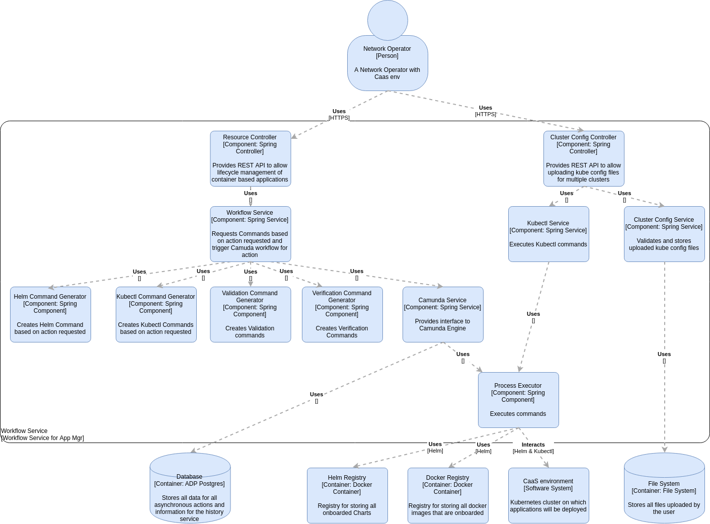

# ADP Application Manager common workflow service

## Overview
This service instantiates a given application in a Kubernetes cluster.

## Things you need to know about this repository

### How to contribute
Contributions are most welcome, just commit your changes, send for review to `HEAD:refs/for/dev` and email the review to team Honey_Badgers @ `<PDLHONEYBA@pdl.internal.ericsson.com>`
```
git push origin HEAD:refs/for/dev
```
This will kick off a gerrit code review job in jenkins, please see the next section for more detail on the CI Flows.
The link to the jenkins jobs is available in the top level pom in this repository, checkout the `<ciManagement>` tag.

### CI Flow defined in code
**Note:** If you don't plan on building the repository locally then you can probably skip this section.
We want to leverage devops best practices where possible. Once such example is to define the CI flow for a project with the following requirements:
* Self generating
* Self managing pipelines
* Reduced setup time when creating new micro services
* Centrally controlled pipelines that can be reconfigured and automatically updated for all flows for each micro service

To achieve this, we have created common CI flows which are code based and use both Jenkins pipelines and job-dsl plugins. This allows us to pragmatically create Jenkins jobs and pipelines to any configuration we want. This common code is managed in a separate git repository and added as a git sub-module to each micro service repository. This allows the CI flows to be controlled centrally and common updates can be rolled out to all micro services CI pipelines without having to make changes in each of these repositories.

To facilitate this, this repository has multiple layers of git sub-modules, to enable these git sub-modules, you need to do the following:
- Go to the top level folder of the repository and run the following git commands `git submodule update --init --recursive --remote am-ci-flow`

## Design



The design documents for this service can be found in the design folder at the root of the repository.
The design is described using the [C4 model](http://c4model.com/).
The design is documented using [draw.io](https://www.draw.io/) with the [C4 plugin](https://github.com/tobiashochguertel/c4-draw.io).
More information and installation instructions can be found [here](https://confluence-nam.lmera.ericsson.se/pages/viewpage.action?pageId=255537501).
Any design that crosses multiple services will be documented in the [ADP Application Manager integration chart repository](https://gerrit.ericsson.se/plugins/gitiles/OSS/com.ericsson.orchestration.mgmt/am-integration-charts/+/refs/heads/master/README.md) or on the [ADP Application Manager Confluence space](https://confluence-nam.lmera.ericsson.se/display/ESO/ADP+Application+Manager).

## Naming Convention for Internal API's using Kubernetes

The internal REST API is only used by EVNFM and would never be documented to the user.
 
For any Kubernetes based API it should follow the naming convention as follows
 
*/api/internal/kubernetes/<new_url_namespace>/....*


Example:

*/api/internal/kubernetes/pods/scale/down*
 
